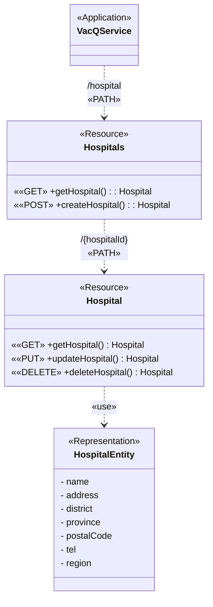
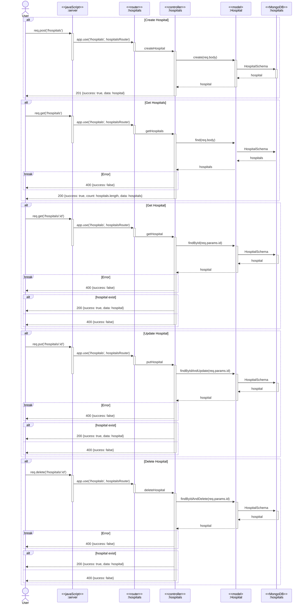

## Class Diagrams

```mermaid
classDiagram
    class VacQService {
        <<Application>>
    }

    class Hospitals {
        <<Resource>>
        ««GET» +getHospital(): Hospital
        ««POST» +createHospital(): Hospital
    }

    VacQService ..> Hospitals: /hospital<br>«PATH»

    class Hospital {
        <<Resource>>
        ««GET» +getHospital() Hospital
        ««PUT» +updateHospital() Hospital
        ««DELETE» +deleteHospital() Hospital
    }

    Hospitals ..> Hospital: /{hospitalId}<br>«PATH»

    class HospitalEntity {
        <<Representation>>
        - name
        - address
        - district
        - province
        - postalCode
        - tel
        - region
    }

    Hospital ..> HospitalEntity: «use»

```

## Sequence Diagrams

```mermaid
sequenceDiagram

actor U as User
participant S as <<javaScript>><br>:server
participant R as <<router>><br>:hospitals
participant C as <<controller>><br>:hospitals
participant M as <<model><br>:Hospital
participant D as <<MongoDB>><br>:hospitals

alt Create Hospital
    U->>+S: req.post('/hospitals')
    S->>+R: app.use('/hospitals', hospitalsRouter)
    R->>+C: createHospital
    deactivate R
    C->>+M: create(req.body)
    deactivate S
    M->>+D: HospitalSchema
    D-->>-M: hospital
    M-->>-C: hospital
    C-->>-U: 201 {success: true, data: hospital}
end

alt Get Hospitals
    U->>+S: req.get('/hospitals')
    S->>+R: app.use('/hospitals', hospitalsRouter)
    R->>+C: getHospitals
    deactivate R
    C->>+M: find(req.body)
    deactivate S
    M->>+D: HospitalSchema
    D-->>M: hospitals
    M-->>C: hospitals
    break Error
        C-->>U: 400 {success: false}
    end
    C-->>-U: 200 {success: true, count: hospitals.length, data: hospitals}
end

alt Get Hospital
    U->>+S: req.get('/hospitals/:id')
    S->>+R: app.use('/hospitals', hospitalsRouter)
    R->>+C: getHospital
    deactivate R
    C->>+M: findById(req.params.id)
    deactivate S
    M->>+D: HospitalSchema
    D-->>-M: hospital
    M-->>-C: hospital
    break Error
        C-->>U: 400 {success: false}
    end
    alt hospital exist
        C-->>U: 200 {sucess: true, data: hospital}
    else
        C-->>-U: 400 {sucess: false}
    end
end


alt Update Hospital
    U->>+S: req.put('/hospitals/:id')
    S->>+R: app.use('/hospitals', hospitalsRouter)
    R->>+C: putHospital
    deactivate R
    C->>+M: findByIdAndUpdate(req.params.id)
    deactivate S
    M->>+D: HospitalSchema
    D-->>-M: hospital
    M-->>-C: hospital
    break Error
        C-->>U: 400 {success: false}
    end
    alt hospital exist
        C-->>U: 200 {sucess: true, data: hospital}
    else
        C-->>-U: 400 {sucess: false}
    end
end

alt Delete Hospital
    U->>+S: req.delete('/hospitals/:id')
    S->>+R: app.use('/hospitals', hospitalsRouter)
    R->>+C: deleteHospital
    deactivate R
    C->>+M: findByIdAndDelete(req.params.id)
    deactivate S
    M->>+D: HospitalSchema
    D-->>-M: hospital
    M-->>-C: hospital
    break Error
        C-->>U: 400 {success: false}
    end
    alt hospital exist
        C-->>U: 200 {sucess: true, data: hospital}
    else
        C-->>-U: 400 {sucess: false}
    end
end
```
